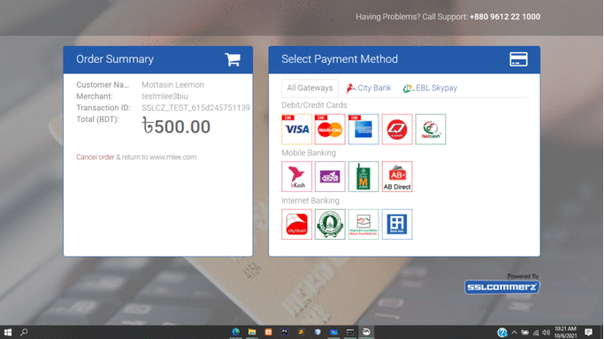
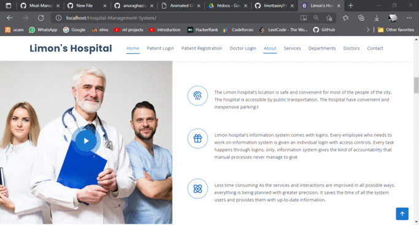

# Hospital-Management-System

---

<!-- PROJECT LOGO -->
## Reallife SSL Commerce Payment Gateway (Developper Account Api)
 

  
  

## Project Gimplse
 

  
  
    

<!-- ABOUT THE PROJECT-->
## About The Project
A Hospital Management System for digitalized the doctor patient relation  with real Payment Gateway form SSL Commerce. 

(<a href="#top">back to top</a>)

---
## Features: 
### Payment Gateway API:
* Make payment with SSL Commerce Gateway with prescriptin id 
* Local DB update with api
* Success page
### Users: 
* Profile (CRUD, Logout)
* Login, Registration
* Downlaod Prescripton with payment
* Prescription History
### Doctor:
* Profile (Login, Logout)
* Presctipn Uplaod
* Uploaded prescription info
  

(<a href="#top">back to top</a>)

  
---
## Built With
* Front-end: HTML, CSS, JS, BOOTSTRAP
* Back-end: PHP, MySql
* API: SLL Commerce Developpers Account

(<a href="#top">back to top</a>)

